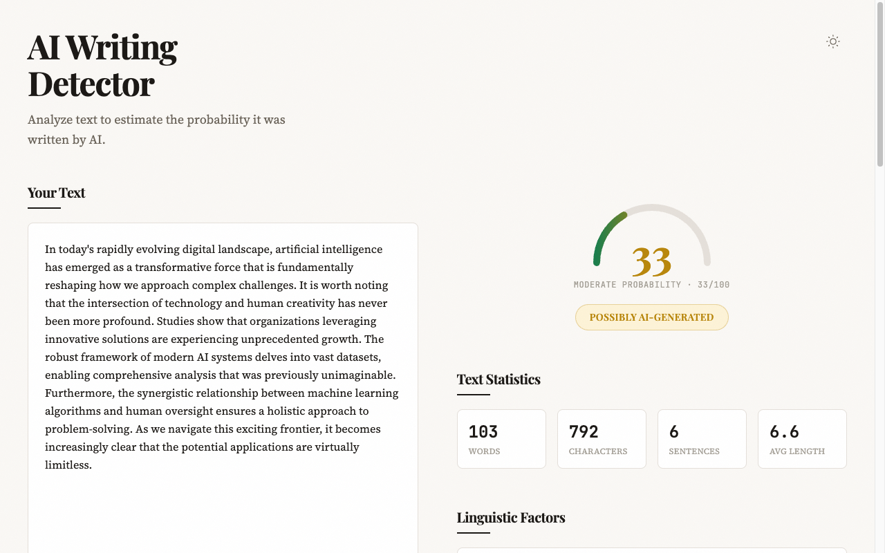
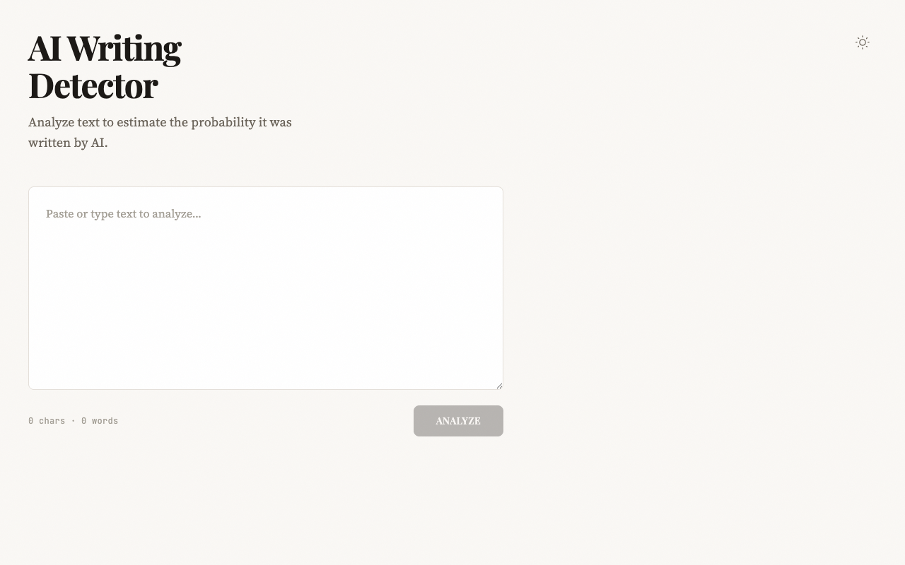
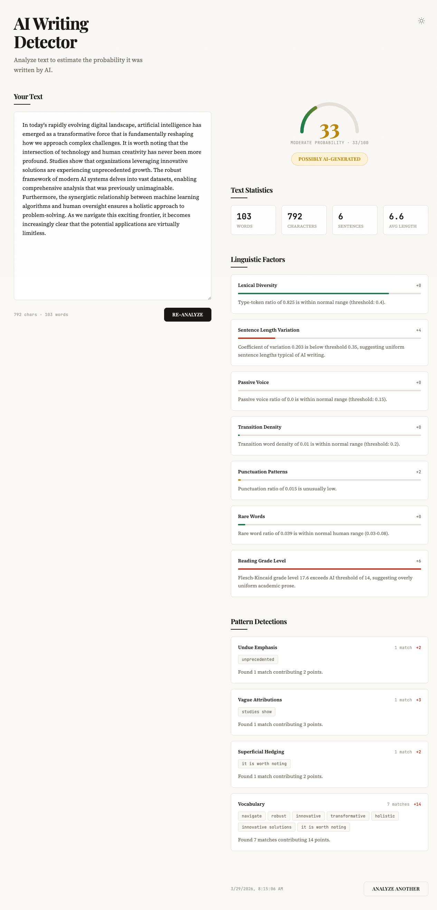
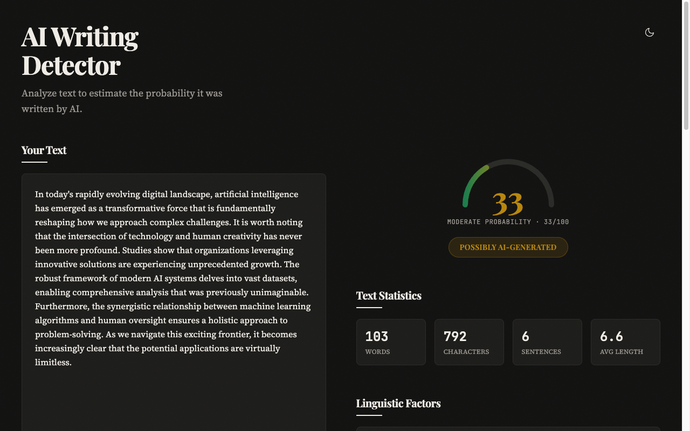

# AI Writing Detector

A rule-based AI writing detection tool that analyzes text using linguistic patterns, vocabulary detection, and statistical analysis to estimate the probability it was written by AI.



## Tech Stack

**Backend** -- Python 3.12, FastAPI, Pydantic, NLTK, wordfreq

**Frontend** -- React 19, TypeScript, Vite, Tailwind CSS 4

**Infrastructure** -- Docker, Docker Compose, Nginx

## How Detection Works

The detector uses a multi-stage analysis pipeline with no machine learning -- it relies entirely on rule-based pattern matching and statistical linguistics.

### Analysis Pipeline

1. **Preprocessing** -- Sentence tokenization (NLTK), word extraction, basic stats (word count, sentence count, avg word length)

2. **Pattern Detection** -- Four independent detectors scan for AI-characteristic patterns:
   - **Vocabulary** -- Flags AI-typical words and phrases ("delve", "robust", "innovative solutions", "it is worth noting")
   - **Structural** -- Detects rule-of-three constructions, negative parallelism, outline-conclusion patterns
   - **Vague Language** -- Identifies empty attributions ("studies show"), superficial hedging, overgeneralizations
   - **Emphasis** -- Finds undue emphasis ("unprecedented"), promotional language, elegant variation

3. **Linguistic Analysis** -- Seven statistical measurements:
   - Lexical diversity (type-token ratio)
   - Sentence length variation (coefficient of variation)
   - Passive voice ratio
   - Transition word density
   - Punctuation density
   - Rare word ratio (via wordfreq)
   - Reading grade level (Flesch-Kincaid)

4. **Score Aggregation** -- Each detector and linguistic factor contributes points weighted by configurable multipliers and caps. If the total exceeds 100, contributions are proportionally scaled down.

5. **Classification** -- The final score maps to a label:
   - `< 30` -- Likely Human-Written
   - `30-59` -- Possibly AI-Generated
   - `>= 60` -- Likely AI-Generated

All thresholds, word lists, and weights are configurable via `backend/config/detectors.yaml`.

## Screenshots

| Input View | Report View |
|---|---|
|  |  |

| Full Report | Dark Mode |
|---|---|
|  |  |

## Setup

### Docker (recommended)

```bash
docker-compose up
```

- Frontend: http://localhost:3000
- Backend API: http://localhost:8000
- Proxied API: http://localhost:3000/api/analyze

### Local Development

**Backend:**

```bash
cd backend
uv sync
uv run uvicorn app.main:app --reload --host 0.0.0.0 --port 8000
```

**Frontend:**

```bash
cd frontend
npm ci
npm run dev
```

The Vite dev server runs on http://localhost:5173 and proxies `/api` requests to the backend.

### Running Tests

```bash
cd backend
uv run pytest -v
uv run pytest --cov=app --cov-report=html  # with coverage
```

## API

**`POST /api/analyze`**

```json
// Request
{ "text": "Text to analyze (min 1 character)" }

// Response
{
  "score": 33,
  "classification": "Possibly AI-Generated",
  "stats": { "word_count": 103, "char_count": 792, "sentence_count": 6, "avg_word_length": 6.6 },
  "linguistic_factors": [{ "name": "Lexical Diversity", "value": 0.825, "score_contribution": 0, "explanation": "..." }],
  "pattern_detections": [{ "category": "Vocabulary", "occurrences": 7, "score_contribution": 14, "details": ["..."], "explanation": "..." }],
  "warnings": [],
  "timestamp": "2026-03-29T00:00:00Z"
}
```

## License

[MIT](LICENSE)
