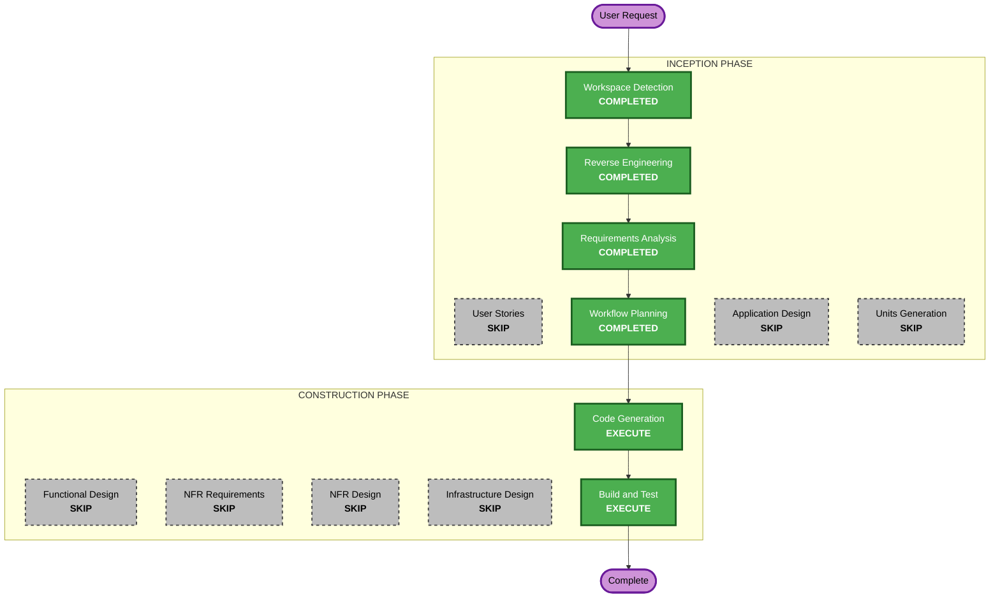

# Execution Plan

## Detailed Analysis Summary

### Transformation Scope
- **Transformation Type**: Multi-component visual redesign (no architectural change)
- **Primary Changes**: All 6 frontend UI components + App shell + CSS + index.html (font loading)
- **Related Components**: None outside frontend/src/

### Change Impact Assessment
- **User-facing changes**: Yes - complete visual overhaul of all UI elements
- **Structural changes**: No - same component tree, same state management
- **Data model changes**: No - types/report.ts unchanged
- **API changes**: No - api/client.ts unchanged
- **NFR impact**: Yes - performance (animations, font loading), accessibility (theme, contrast, motion preferences)

### Component Relationships
```
index.html (font loading) --> App.tsx (theme provider, view routing)
                                |
                                +-- TextInput.tsx (input view)
                                +-- ReportView.tsx (report view)
                                      |
                                      +-- ScoreGauge.tsx (SVG arc)
                                      +-- ClassificationBadge.tsx
                                      +-- LinguisticFactors.tsx
                                      +-- PatternBreakdown.tsx
```
All components change in parallel -- no sequential dependency for implementation.

### Risk Assessment
- **Risk Level**: Low - visual-only changes, no logic changes, no API changes
- **Rollback Complexity**: Easy - git revert
- **Testing Complexity**: Simple - visual verification, existing data-testid preserved

## Workflow Visualization



## Phases to Execute

### INCEPTION PHASE
- [x] Workspace Detection (COMPLETED)
- [x] Reverse Engineering (COMPLETED)
- [x] Requirements Analysis (COMPLETED)
- [x] User Stories - SKIP
  - **Rationale**: Pure UI/UX visual enhancement with single user type. No user persona complexity or workflow changes.
- [x] Workflow Planning (COMPLETED)
- [x] Application Design - SKIP
  - **Rationale**: No new components or services. Same component tree with visual-only changes.
- [x] Units Generation - SKIP
  - **Rationale**: Single unit of work -- all frontend components change together as one cohesive redesign.

### CONSTRUCTION PHASE
- [x] Functional Design - SKIP
  - **Rationale**: No new data models, business logic, or algorithms. Visual redesign only.
- [x] NFR Requirements - SKIP
  - **Rationale**: NFR requirements already captured in requirements.md (performance, accessibility, responsiveness). No separate assessment needed.
- [x] NFR Design - SKIP
  - **Rationale**: NFR Requirements skipped.
- [x] Infrastructure Design - SKIP
  - **Rationale**: No infrastructure changes. Same Docker/Nginx setup.
- [ ] Code Generation - EXECUTE (ALWAYS)
  - **Rationale**: Implementation of the visual redesign across all frontend components.
- [ ] Build and Test - EXECUTE (ALWAYS)
  - **Rationale**: Verify build succeeds and visual verification instructions.

### OPERATIONS PHASE
- [ ] Operations - PLACEHOLDER

## Package Change Sequence
Single package (frontend) -- no sequencing needed. All component files change in one unit.

## Success Criteria
- **Primary Goal**: Transform the frontend from generic UI to distinctive editorial/magazine aesthetic
- **Key Deliverables**:
  - Adaptive dark/light theme with toggle
  - SVG arc gauge with animated gradient fill
  - Rich animations (staggered entrance, scroll reveal, hover states)
  - Editorial typography via Google Fonts
  - Single-scroll narrative report layout
  - All existing functionality preserved
- **Quality Gates**:
  - All existing data-testid attributes preserved
  - TypeScript compiles with zero errors
  - Both dark and light themes render correctly
  - Animations respect prefers-reduced-motion
  - Responsive on mobile through desktop
