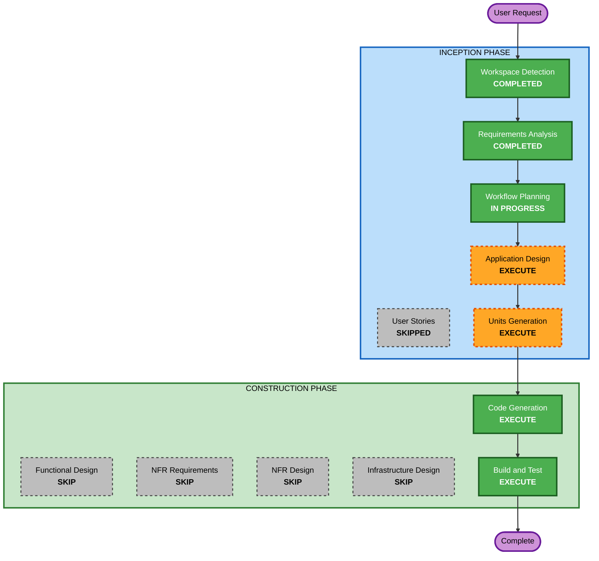

# Execution Plan

## Detailed Analysis Summary

### Change Impact Assessment
- **User-facing changes**: Yes -- new full-stack web application (text input + analysis report)
- **Structural changes**: Yes -- entirely new monorepo with backend/frontend
- **Data model changes**: No -- no persistent storage, all in-memory analysis
- **API changes**: Yes -- new POST /api/analyze endpoint (fully specified in spec.md)
- **NFR impact**: Minimal -- prototype project, security rules disabled

### Risk Assessment
- **Risk Level**: Low
- **Rollback Complexity**: Easy (greenfield, no existing state to protect)
- **Testing Complexity**: Moderate (multiple detectors each need positive/negative/cap/edge tests)

---

## Workflow Visualization



### Text Alternative
```
Phase 1: INCEPTION
  - Workspace Detection      (COMPLETED)
  - Requirements Analysis     (COMPLETED)
  - User Stories              (SKIPPED)
  - Workflow Planning         (IN PROGRESS)
  - Application Design        (EXECUTE)
  - Units Generation          (EXECUTE)

Phase 2: CONSTRUCTION (per unit)
  - Functional Design         (SKIP)
  - NFR Requirements          (SKIP)
  - NFR Design                (SKIP)
  - Infrastructure Design     (SKIP)
  - Code Generation           (EXECUTE)
  - Build and Test            (EXECUTE)
```

---

## Phases to Execute

### INCEPTION PHASE
- [x] Workspace Detection (COMPLETED)
- [x] Requirements Analysis (COMPLETED)
- [x] User Stories - SKIPPED
  - **Rationale**: Single user type (person pasting text), simple interaction model, prototype scope. Spec already defines the two UI states (input/report) completely.
- [x] Workflow Planning (IN PROGRESS)
- [ ] Application Design - EXECUTE
  - **Rationale**: The spec defines components individually but does not formalize the data flow between preprocessing -> detectors -> analyzers -> aggregator -> report builder. A component interaction diagram and method signature catalogue will give code generation a precise contract to implement against.
- [ ] Units Generation - EXECUTE
  - **Rationale**: The spec lists 10 implementation phases but some are very small (single detector + tests). Consolidating into fewer, balanced units will make code generation more efficient and reduce per-unit overhead.

### CONSTRUCTION PHASE (per unit)
- [ ] Functional Design - SKIP (all units)
  - **Rationale**: The spec already defines detector interfaces (BaseDetector with detect/score), scoring formulas, config schema, API contracts, and classification thresholds. Additional functional design would repeat the spec.
- [ ] NFR Requirements - SKIP (all units)
  - **Rationale**: Security rules disabled. No performance, scalability, or reliability requirements beyond "it works" for this prototype.
- [ ] NFR Design - SKIP (all units)
  - **Rationale**: No NFR requirements to design for.
- [ ] Infrastructure Design - SKIP (all units)
  - **Rationale**: Docker Compose with two containers (backend + frontend) is straightforward enough to handle directly in code generation.
- [ ] Code Generation - EXECUTE (all units)
  - **Rationale**: Core deliverable. Always executes.
- [ ] Build and Test - EXECUTE
  - **Rationale**: Build instructions, test execution, coverage validation. Always executes.

### OPERATIONS PHASE
- [ ] Operations - PLACEHOLDER
  - **Rationale**: Future expansion. Not applicable for this project.

---

## Success Criteria
- **Primary Goal**: Working AI writing detector that scores text 0-100 with detailed breakdown
- **Key Deliverables**:
  - Python/FastAPI backend with 4 pattern detectors + 7 linguistic analyzers
  - React/TypeScript/Tailwind frontend with input and report views
  - Docker Compose configuration for containerized deployment
  - Test suite with >= 85% coverage on backend/app/
- **Quality Gates**:
  - AI-written test essays score >= 60
  - Human-written test essays score < 30
  - All unit and integration tests pass
  - API response matches Pydantic schema
