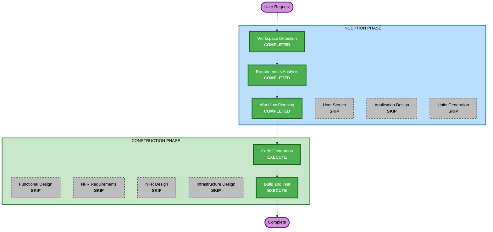

# Iteration 2 Execution Plan

## Detailed Analysis Summary

### Transformation Scope
- **Transformation Type**: Single component area (frontend state + layout)
- **Primary Changes**: Lift text state to App.tsx, add editable textarea to ReportView, widen layout
- **Related Components**: App.tsx, TextInput.tsx, ReportView.tsx, index.css

### Change Impact Assessment
- **User-facing changes**: Yes - text visible in report, inline re-analysis, wider layout
- **Structural changes**: No - same component architecture, just state lifting
- **Data model changes**: No - types/report.ts unchanged
- **API changes**: No - backend untouched
- **NFR impact**: No - same performance, security, accessibility profile

### Component Relationships
- **Primary**: App.tsx (state owner) -> ReportView.tsx (receives text + handlers)
- **Modified**: TextInput.tsx (receives text from parent instead of local state)
- **Styling**: index.css (layout width adjustments)
- **Unchanged**: ScoreGauge, ClassificationBadge, LinguisticFactors, PatternBreakdown, ThemeToggle, api/client.ts, types/report.ts

### Risk Assessment
- **Risk Level**: Low
- **Rollback Complexity**: Easy (3-4 files modified)
- **Testing Complexity**: Simple (manual visual + existing testid verification)

## Workflow Visualization



### Text Alternative
```
Phase 1: INCEPTION
  - Workspace Detection (COMPLETED)
  - Requirements Analysis (COMPLETED)
  - Workflow Planning (COMPLETED)
  - User Stories (SKIP)
  - Application Design (SKIP)
  - Units Generation (SKIP)

Phase 2: CONSTRUCTION
  - Functional Design (SKIP)
  - NFR Requirements (SKIP)
  - NFR Design (SKIP)
  - Infrastructure Design (SKIP)
  - Code Generation (EXECUTE)
  - Build and Test (EXECUTE)
```

## Phases to Execute

### INCEPTION PHASE
- [x] Workspace Detection (COMPLETED)
- [x] Requirements Analysis (COMPLETED)
- [x] Workflow Planning (COMPLETED)
- [ ] User Stories - SKIP
  - **Rationale**: UI enhancement with single user type, no persona complexity
- [ ] Application Design - SKIP
  - **Rationale**: No new components or services; modifying existing component boundaries
- [ ] Units Generation - SKIP
  - **Rationale**: Single unit of work (frontend state + layout changes)

### CONSTRUCTION PHASE
- [ ] Functional Design - SKIP
  - **Rationale**: No new business logic or data models; state lifting is mechanical
- [ ] NFR Requirements - SKIP
  - **Rationale**: No new performance, security, or scalability requirements
- [ ] NFR Design - SKIP
  - **Rationale**: NFR Requirements skipped
- [ ] Infrastructure Design - SKIP
  - **Rationale**: No infrastructure changes; frontend-only modification
- [ ] Code Generation - EXECUTE (ALWAYS)
  - **Rationale**: Implementation of text visibility, inline editing, and responsive layout
- [ ] Build and Test - EXECUTE (ALWAYS)
  - **Rationale**: Build verification and test instructions

## Extension Compliance
| Extension | Status | Rationale |
|---|---|---|
| Security Baseline | N/A (Disabled) | Disabled in iteration 1; no security-relevant changes |

## Success Criteria
- **Primary Goal**: Analyzed text visible and editable in report view with re-analysis capability
- **Key Deliverables**: Modified App.tsx, TextInput.tsx, ReportView.tsx, index.css
- **Quality Gates**: TypeScript 0 errors, all 14 data-testid attributes preserved, Vite build passes
